# 距离控制的音乐灯

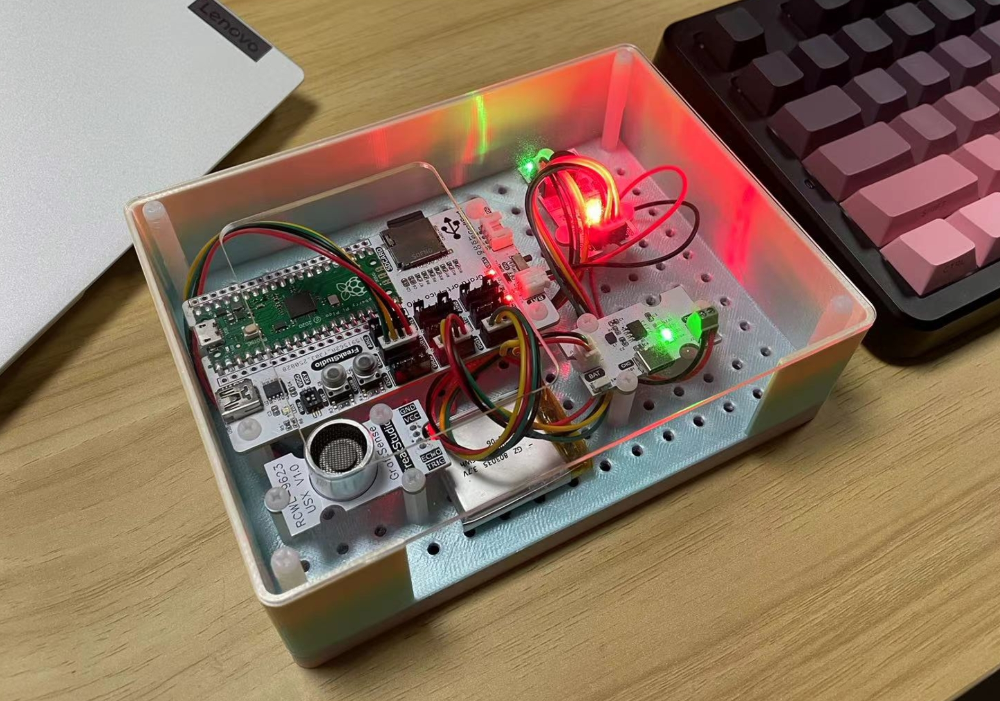
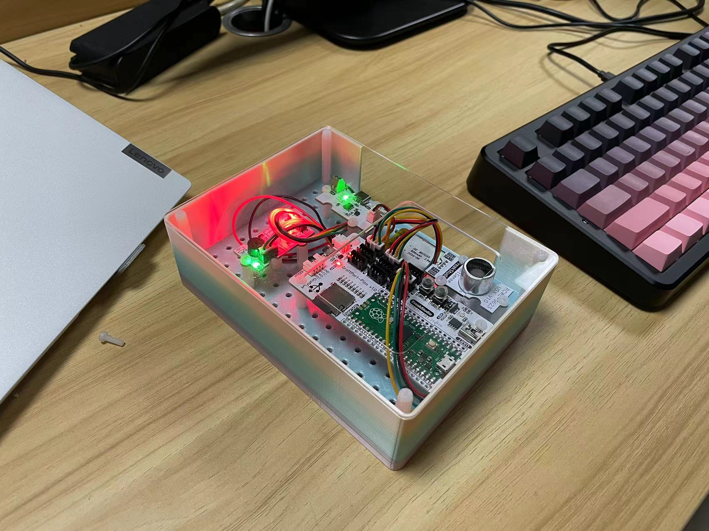

## 目录
- [简介（Description）](#简介description)
- [主要功能（Features）](#主要功能features)
- [硬件要求（Hardware Requirements）](#硬件要求hardware-requirements)
- [软件环境（Software Environment）](#软件环境software-environment)
- [文件结构（File Structure）](#文件结构file-structure)
- [文件说明（File Description）](#文件说明file-description)
- [软件设计核心思想（Design Idea）](#软件设计核心思想design-idea)
- [使用说明（Quick Start）](#使用说明quick-start)
- [示例程序（Example）](#示例程序example)
- [注意事项（Notes）](#注意事项notes)
- [版本记录（Version History）](#版本记录version-history)
- [联系开发者（Contact）](#联系开发者contact)
- [许可协议（License）](#许可协议license)

## 简介（Description）

### 项目背景

传统LED灯多为固定亮度调节，蜂鸣器多为单一音效，缺乏与环境的互动性。本项目基于GraftPort-RP2040开发板，结合RCWL9623高精度测距传感器，实现“距离-声光”联动控制，解决传统声光设备互动性不足的问题，同时融入MicroPython的轻量化任务调度与异常处理机制，保证系统稳定运行。

### 项目主要功能概览

本项目基于MicroPython开发，核心功能是通过RCWL9623测距传感器实时检测目标距离，经数据滤波后动态控制PiranhaLED亮度（距离越近，亮度越高）与无源蜂鸣器频率（距离越近，频率越高）；支持板载按键中断切换任务启停，内置自动垃圾回收（GC）避免内存泄漏，异常捕获与限速打印便于问题定位，传感器初始化重试机制提升硬件兼容性。

### 适用场景或应用领域

- 智能家居：作为互动式氛围灯，如靠近时亮度提升、播放高频音效，远离时降低亮度、切换低频音效；  
- 互动装置：科技馆、展厅的体验式设备，通过距离触发声光变化；  
- 教学演示：用于MicroPython任务调度、I2C传感器通信、中断处理、数据滤波等知识点的实践教学；  
- 小型玩具：儿童互动玩具，通过距离控制声光反馈，增强趣味性。

## 主要功能（Features）

- **实时测距与数据滤波**：通过RCWL9623传感器每200ms采集一次距离（单位：cm），采用“三点均值滤波+异常值剔除（差值≤100cm）”机制，避免瞬时干扰，保证数据稳定性；  
- **LED亮度动态控制**：基于距离实现非线性亮度映射（近亮远暗），距离范围可配置（默认25-100cm），指数映射（指数=5）增强亮度变化的灵敏度；  
- **蜂鸣器频率联动**：将距离分段映射到预设音符（如A5、G5等，近高频远低频），超出最大距离时自动静音，音符序列支持动态生成与兜底配置；  
- **按键中断交互**：板载按键触发下降沿中断，可切换核心任务“运行/暂停”，暂停时立即关闭LED与蜂鸣器并清空滤波缓冲，避免恢复时数据异常；  
- **自动内存管理**：空闲时检测内存，若低于阈值（默认100000字节）自动触发GC，防止MicroPython因内存泄漏崩溃；  
- **异常容错机制**：传感器初始化支持多次重试（次数可配置），失败时LED闪灯+终端报错阻塞；任务执行抛异常时，完整打印回溯信息并限速（默认1秒/次），避免刷屏；  
- **板级适配灵活**：基于board.py实现引脚映射解耦，支持后续扩展其他RP2040开发板，无需修改核心业务逻辑。


## 硬件要求（Hardware Requirements）

项目基于GraftPort-RP2040开发板作为主控：

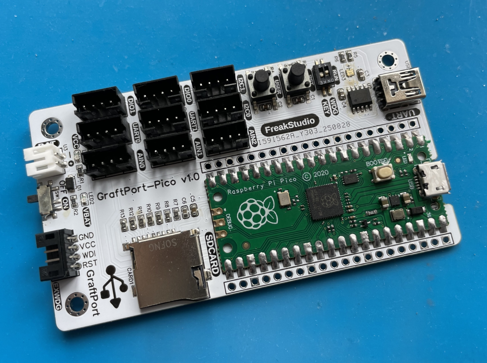

**其余需要的模块包括：**
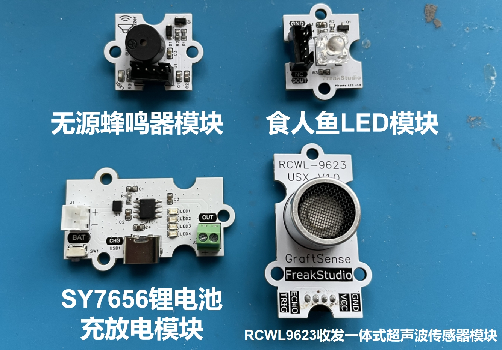
* GtaftSense-RCWL9623收发一体式超声波传感器模块（I2C通信，默认地址0x57，支持25-700cm测距范围）；
* GtaftSense-食人鱼LED灯模块（单路LED，共阴极，代码中配置`POLARITY_CATHODE`）；
* GtaftSense-无源蜂鸣器模块（需频率驱动，不支持直接高低电平控制）；
* GtaftSense-SY7656锂电池充放电模块（连接聚合物锂电池，输出5V电压，带Type-C充电接口）；
* 板载按键：默认使用开发板固定引脚（引脚18，上拉输入），无需额外接线。
* 板载LED：默认使用开发板固定引脚（引脚25），无需额外接线。

**连接方式：**

1. **硬件连线**  
   * **RCWL9623收发一体式超声波传感器模块**：通过 PH2.0-4P 连接线接入 I2C0 接口；  
   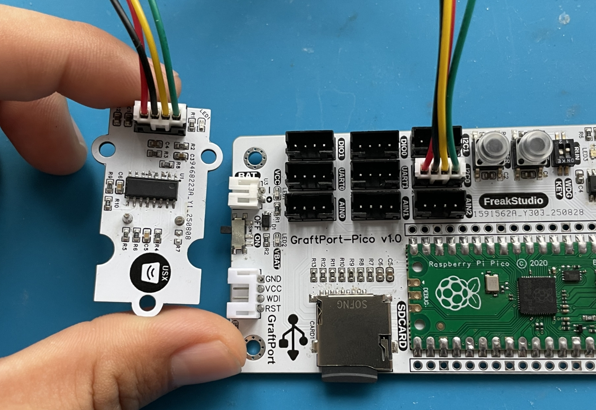
   * **食人鱼 LED 灯模块**：通过 PH2.0-4P 连接线接入数字接口 0；  
   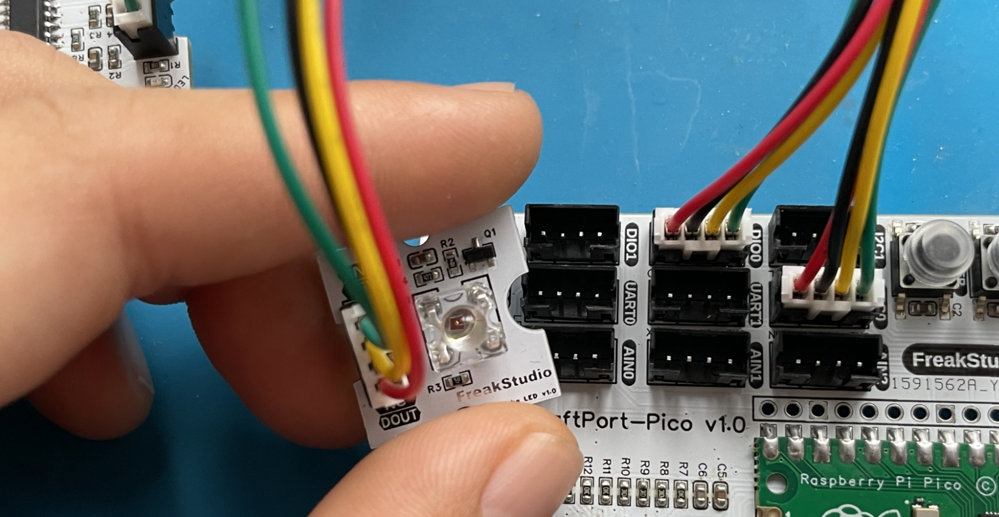
   * **无源蜂鸣器模块**：通过 PH2.0-4P 连接线接入数字接口 1； 
   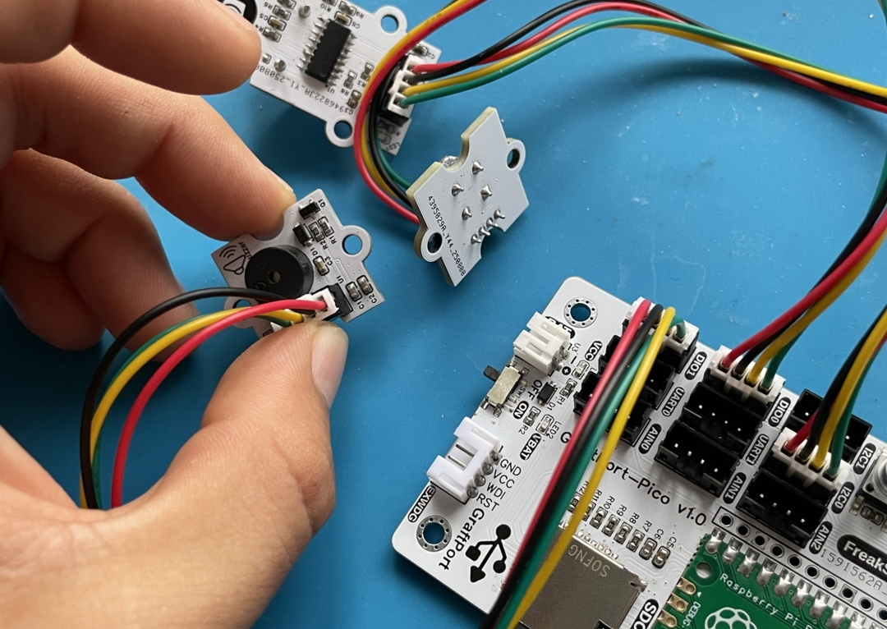
   * **锂电池充放电模块**：BAT 接口连接锂电池，OUT 接口通过 PH2.0-2P 连接线为主控板供电。  
   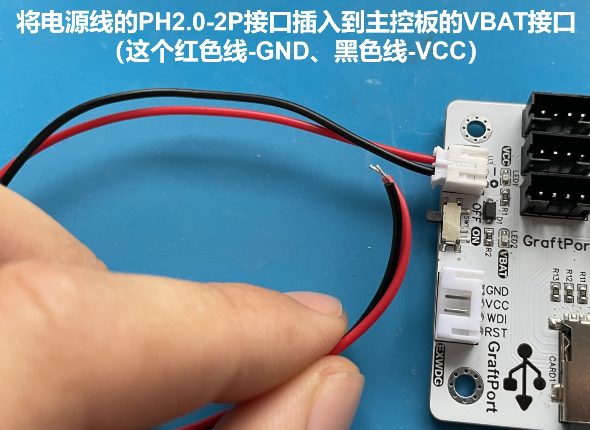
   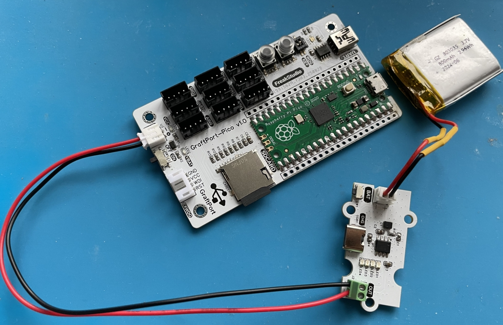
   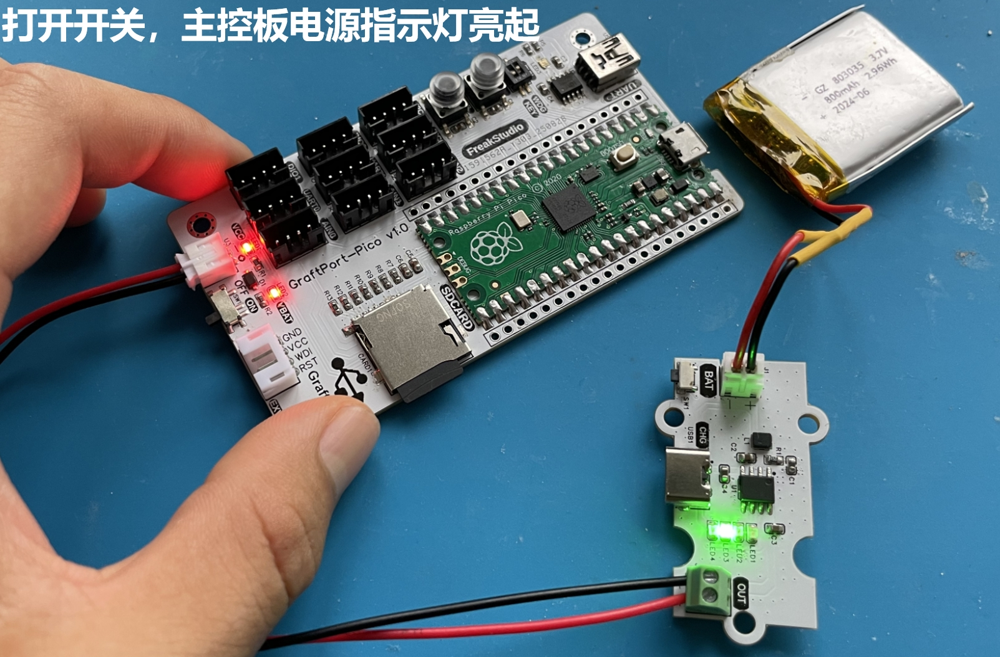

2. **装置装配**  
   * 首先，使用 M3 塑料柱将各模块与主控板固定在外壳底板上（主控板与外壳均预留 M3 螺丝孔）；
   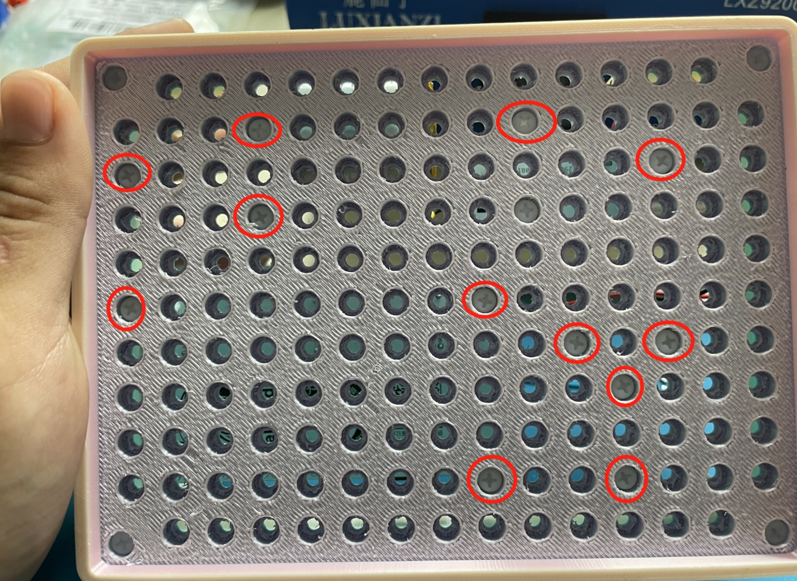
   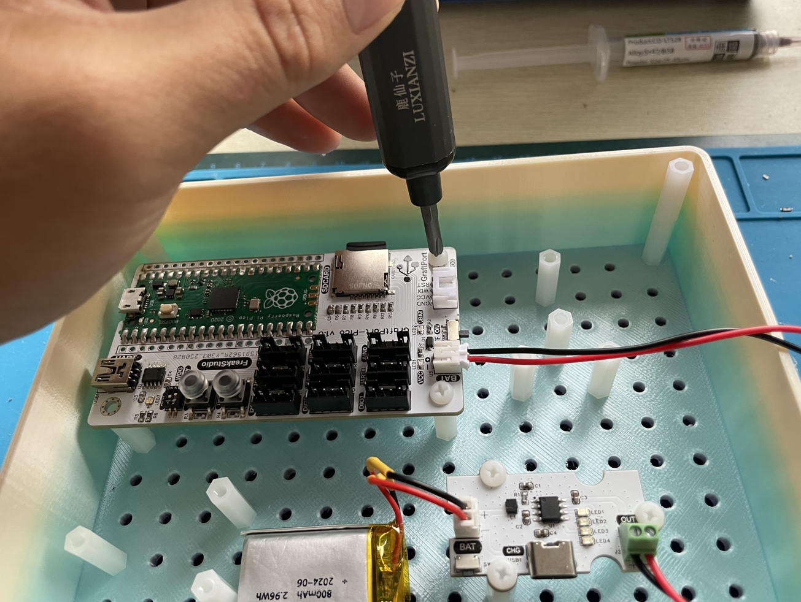
   * 接着，利用 M3 塑料柱将外壳四周固定好，并在对应位置拧上 M3 螺丝完成装配：
   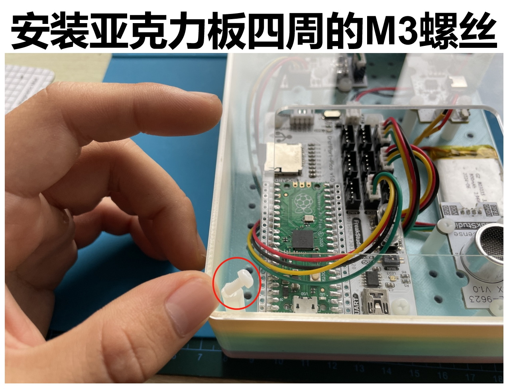

3. **注意事项**
   * 在主控板不连接外部看门狗模块时，RUN拨码开关2要导通：
   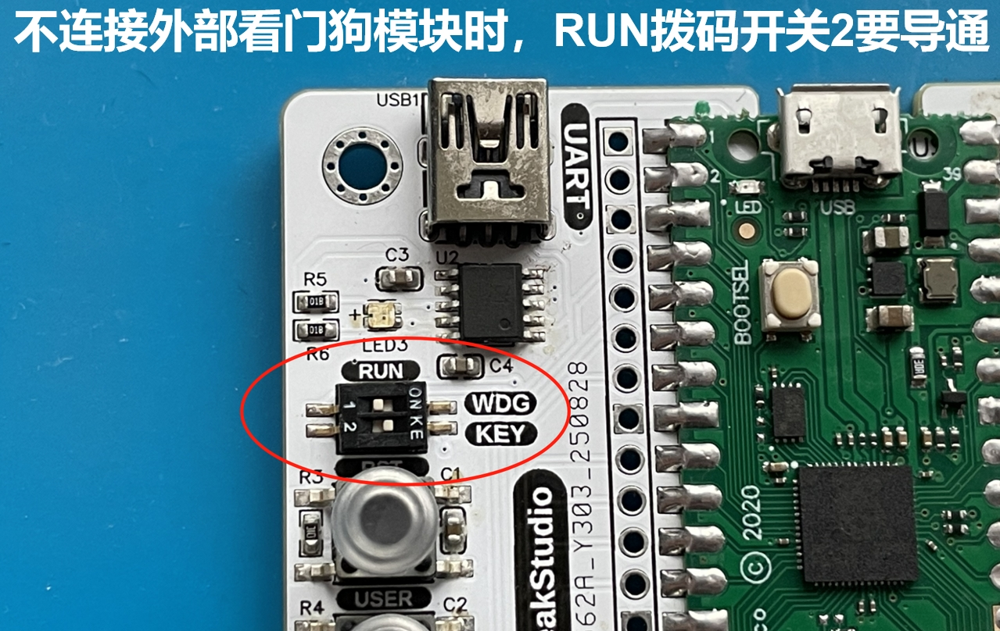
   * 锂电池充放电模块支持电量显示，使用下面Type-C接口即可充电
   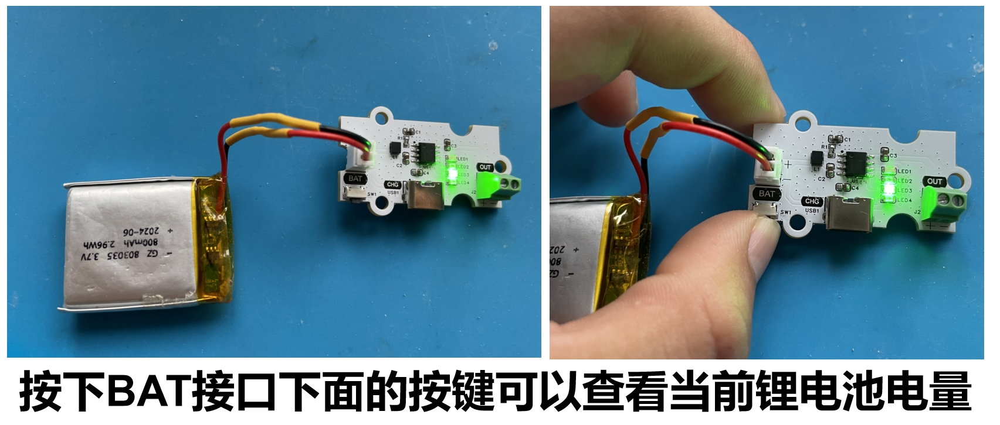

## 软件环境（Software Environment）
- 核心固件：MicroPython v1.23.0（需适配GraftPort-RP2040，支持`machine.Pin/I2C/Timer`模块、软定时器调度）； 
- 开发IDE：PyCharm（用于代码编写、上传、调试，支持MicroPython REPL交互，需要安装MicroPython插件）；
- 辅助工具：  
  - Python 3.12+（用于运行本地辅助脚本，如固件烧录脚本，可选）；  
  - mpy-cross v1.23.0（用于将.py文件编译为.mpy，减少开发板内存占用，可选）；  
  - mpremote v0.11.0+（替代Thonny上传文件，支持命令行操作，可选）；  
- 依赖模块：无额外第三方库，所有驱动（`passive_buzzer_driver.py`等）均为自定义实现，随项目文件提供。

## 文件结构（File Structure）

```
项目根目录/
├── libs/                       # 通用工具库文件夹，存放可复用的核心模块
│   └── scheduler/              # 任务调度器库，实现基于软定时器的多任务管理（支持任务添加/暂停/恢复，空闲/异常回调）
├── drivers/                    # 硬件驱动文件夹，封装不同外设的控制接口（高内聚，仅暴露必要方法）
│   ├── passive_buzzer_driver/    # 无源蜂鸣器驱动包，提供`play_tone(freq, duration)`方法
│   ├── piranha_led_driver/       # PiranhaLED驱动包，提供`set_brightness(percent)`方法
│   └── rcwl9623_driver/          # RCWL9623驱动包，提供`read_distance()`方法
├── tasks/                      # 任务逻辑文件夹，存放业务相关的任务实现（与硬件驱动解耦）
│   ├── sensor_task.py          # 核心任务模块，定义`SensorBuzzerLedTask`类，实现“测距→滤波→声光控制”完整逻辑
│   └── maintenance.py          # 维护任务模块，提供`task_idle_callback`（自动GC）、`task_err_callback`（异常处理）
├── main.py                     # 项目入口文件，负责硬件初始化、任务创建、调度器启动、异常阻塞处理
├── board.py                    # 板级支持文件，定义GraftPort-RP2040的引脚映射（固定引脚、I2C/DIO/ADC接口）
├── conf.py                     # 配置文件，存放可自定义参数（如传感器初始化重试次数、GC阈值等）
├── README.md                   # 项目说明文档，包含功能介绍、使用步骤、注意事项等
├── build/                      # 构建产物/脚本/固件打包规范（占位）
├── tools/                      # 开发/测试/打包辅助脚本
└── docs/                       # 文档：设计说明、API规范、开发板引脚映射及相关图片
    ├── graftport_pinout_table.md   # GraftPort-RP2040 引脚映射表
    ├── xxx.jpg                 # 开发板\m模块\接线相关若干照片
└── examples                    # 一些运行示例文件夹，该项目没有。
```

如果您想添加其他传感器模块到主控板上，建议您可以查看docs文件夹下的`graftport_pinout_table.md`文件查看引脚映射。

## 关键文件说明（File Description）

- `main.py`：项目入口，核心逻辑包括：  
  1. 上电延时3秒（等待硬件稳定），初始化板载LED、扩展LED、蜂鸣器、按键（含中断注册）；  
  2. 初始化I2C0与RCWL9623传感器（支持多次重试，失败则调用`fatal_hang`阻塞并闪灯报错）；  
  3. 创建`SensorBuzzerLedTask`实例（传入硬件驱动与配置参数），封装为调度器任务（周期200ms）；  
  4. 初始化`Scheduler`（软定时器，调度周期50ms），添加任务并启动调度，进入无限循环；  
  5. 定义`button_handler`中断回调（切换任务启停）、`fatal_hang`阻塞函数（严重错误处理）。

- `tasks/sensor_task.py`：核心业务任务，`SensorBuzzerLedTask`类关键逻辑：  
  1. `__init__`：初始化硬件实例、滤波缓冲（`deque`容量3）、音符映射表（按距离分段匹配音符）；  
  2. `tick`：每200ms执行一次，流程为“读取原始距离→异常值过滤→三点均值滤波→计算LED占空比→匹配蜂鸣器频率→控制硬件”；  
  3. `_compute_led_duty`：实现距离到LED亮度的非线性映射（指数=5），避免亮度变化过于平缓；  
  4. `_choose_note`：根据滤波后距离匹配音符，超出范围时返回“OFF”（静音）；  
  5. `immediate_off`：立即关闭LED与蜂鸣器并清空缓冲，供按键暂停时调用。

- `tasks/maintenance.py`：系统维护模块，关键函数：  
  1. `task_idle_callback`：调度器空闲时触发，检测内存低于`GC_THRESHOLD_BYTES`（默认100000字节）则执行`gc.collect()`；  
  2. `task_err_callback`：任务抛异常时触发，打印完整回溯信息（优先`sys.print_exception`），并延时`ERROR_REPEAT_DELAY_S`（默认1秒）防止刷屏；  
  3. 支持从`conf.py`读取配置，无配置时使用默认值，保证兼容性。

- `drivers/xxx_driver`：硬件驱动模块，均采用“实例化+方法调用”模式，仅暴露与硬件相关的控制接口，屏蔽底层细节：  
  - `passive_buzzer_driver.py`：`Buzzer`类通过`Pin`输出PWM信号，`play_tone`方法控制频率与播放时长；  
  - `piranha_led_driver.py`：`PiranhaLED`类通过PWM控制亮度，`set_brightness`接收0-100%百分比参数；  
  - `rcwl9623_driver.py`：`RCWL9623`类通过I2C读取传感器寄存器，`read_distance`返回测距值（cm）或None（失败）。

- `board.py`：板级引脚映射模块，定义`BOARDS`字典（含GraftPort-RP2040的固定引脚、I2C/DIO/ADC接口映射），提供`get_fixed_pin`、`get_i2c_pins`等接口，实现“板级配置与业务逻辑解耦”，后续扩展其他开发板只需添加`BOARDS`子项。

- `conf.py`：用户配置文件，需用户手动定义的参数包括：`I2C_INIT_MAX_ATTEMPTS`（传感器初始化重试次数）、`I2C_INIT_RETRY_DELAY_S`（重试间隔秒数）、`ENABLE_DEBUG`（调试打印开关）、`AUTO_START`（任务是否自动启动），无定义时系统使用默认值。


## 软件设计核心思想（Design Idea）

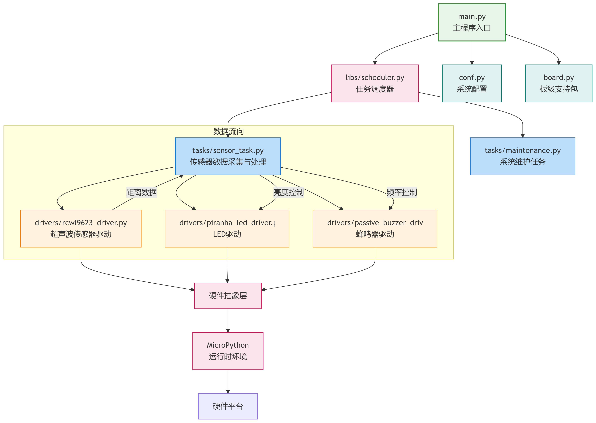

### 1. 系统分层思路：采用“四层架构”，实现解耦与复用
- 硬件驱动层（drivers/）：仅负责硬件的底层控制，不包含业务逻辑，如蜂鸣器驱动只关心“如何播放指定频率”，不关心“何时播放”；  
- 任务逻辑层（tasks/）：基于驱动层提供的接口实现业务逻辑，如`SensorBuzzerLedTask`只调用驱动的`set_brightness`，不关心LED的引脚编号；  
- 调度控制层（libs/scheduler.py）：提供通用的任务管理能力，支持任务添加/暂停/恢复、空闲/异常回调，不依赖具体业务；  
- 入口层（main.py）：负责“组装”各层，初始化硬件→创建任务→启动调度，是系统的“胶水”，不包含核心业务逻辑。


### 2. 模块划分原则：高内聚、低耦合，便于维护与扩展
- 高内聚：每个模块只负责单一职责，如`maintenance.py`仅处理系统维护（GC、异常），不涉及声光控制；  
- 低耦合：模块间通过“接口”交互，而非直接操作内部变量，如`SensorBuzzerLedTask`通过`rcwl.read_distance()`获取数据，不直接访问RCWL9623的I2C寄存器；  
- 扩展性：新增硬件（如温度传感器）时，只需在`drivers/`添加对应驱动，在`tasks/`创建新任务，无需修改现有代码；扩展开发板时，只需在`board.py`添加引脚映射，不影响业务逻辑。

### 3. 核心机制：保障系统稳定与用户体验
- 任务调度机制：基于软定时器（`Timer(-1)`）实现，调度周期50ms，核心任务周期200ms，通过“计数器累加”判断任务是否到执行时间，避免定时器嵌套冲突；  
- 数据滤波机制：采用“异常值剔除+三点均值滤波”，既过滤瞬时跳变（如传感器误读），又保证数据实时性，避免纯均值滤波的滞后问题；  
- 交互反馈机制：按键中断回调“即时生效”，暂停时立即关闭声光，避免用户操作后无响应；传感器初始化失败时“明确报错”（闪灯+终端信息），便于定位硬件连接问题；  
- 容错机制：所有关键操作（如硬件控制、内存读取）均用`try-except`包裹，避免单一模块故障导致整个系统崩溃，如LED控制失败不影响蜂鸣器正常工作。

### 4. 任务执行流程
任务执行流程如下所示
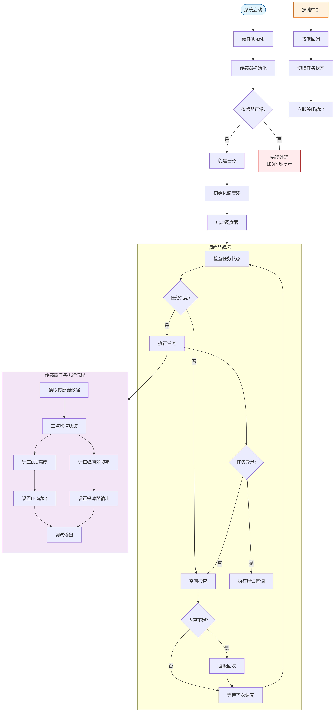

## 使用说明（Quick Start）

### 1. 硬件连接

按“硬件要求”中的连接方式，连接主控板、各个传感器模块和电池；  

### 2. 运行项目（使用 PyCharm + MicroPython 插件）

1. 打开 PyCharm 并安装对应的 MicroPython 插件。  
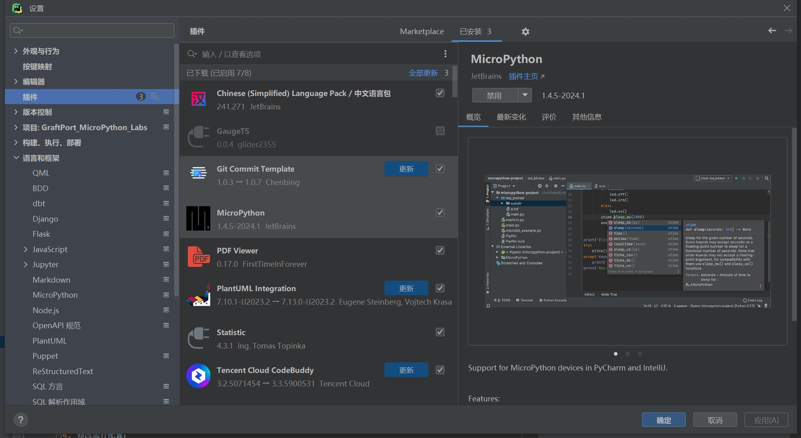
2. 在插件中选择 **运行设备（Target Device）** 为 `RP2040`，并启用 **自动检测设备路径（Auto-detect device path）**。  
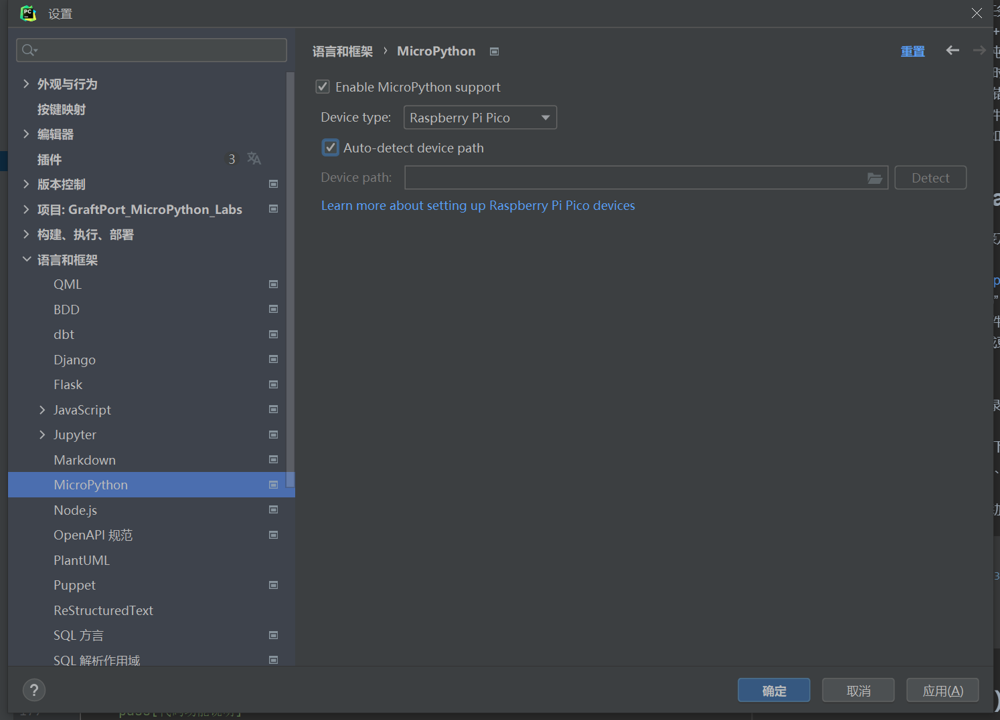
3. 将 **Project/firmware** 设置为项目根目录。  

4. 修改运行配置：
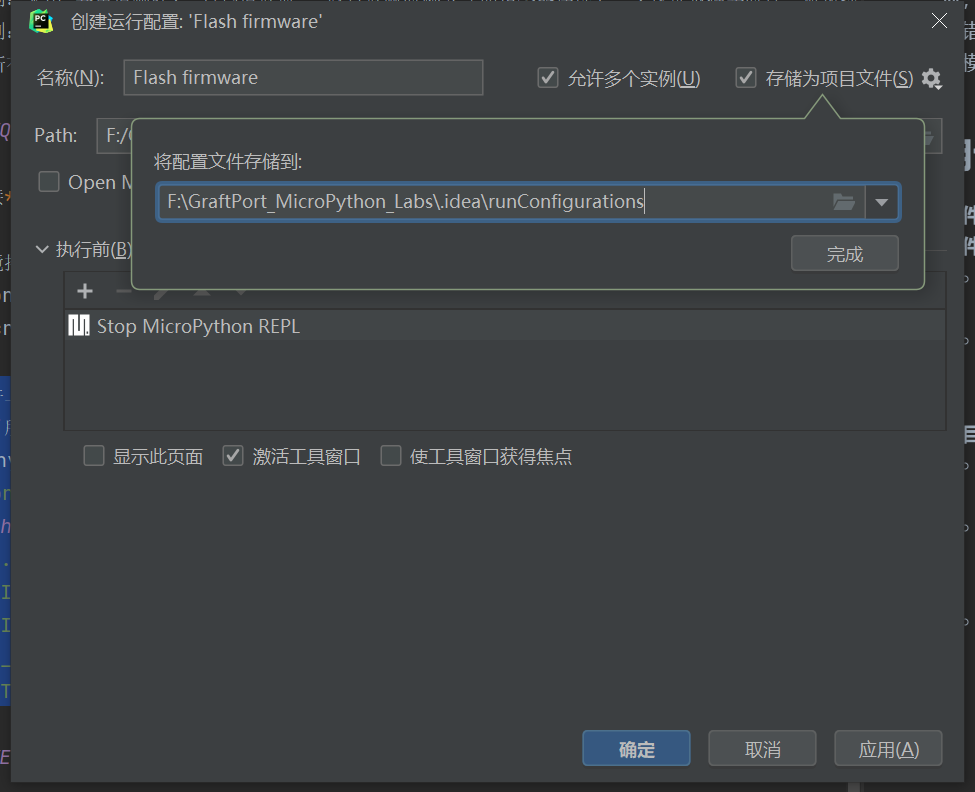
   - 勾选 **允许多个实例（Allow multiple instances）**  
   - 选择 **存储为项目文件（Store as project file）**  
   - 点击 **确定** 保存配置。
5. 点击 IDE 右上角的绿色三角按钮运行，即可开始上传固件并执行项目。
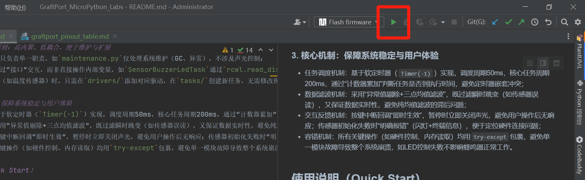
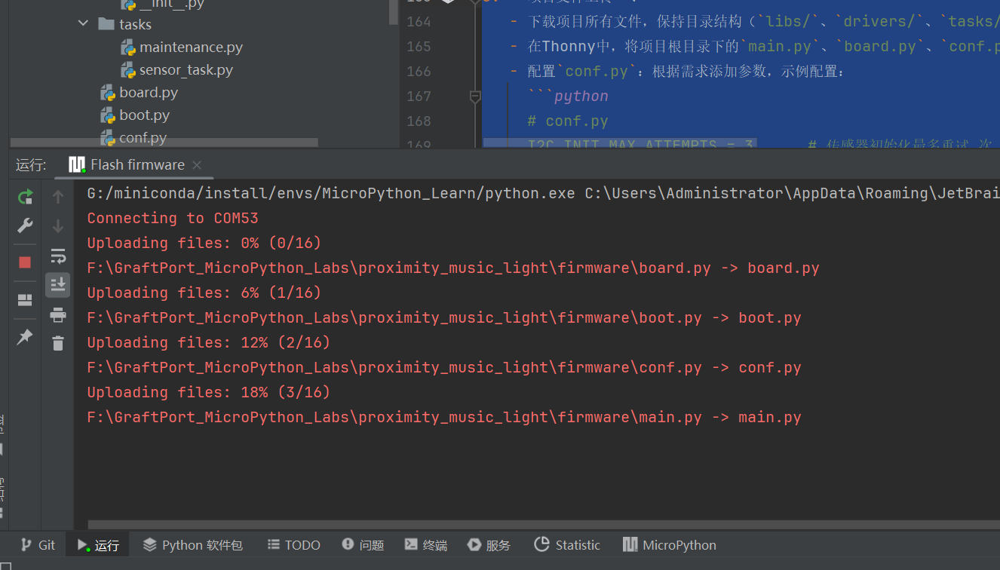

### 3. 运行配置的修改

您可以配置 `conf.py`，根据需求修改或添加参数，例如：
```python
# conf.py 示例配置
I2C_INIT_MAX_ATTEMPTS = 3      # 传感器初始化最多重试次数
I2C_INIT_RETRY_DELAY_S = 0.5   # 每次重试间隔（秒）
ENABLE_DEBUG = True            # 是否开启调试打印
AUTO_START = True              # 是否在启动时自动运行任务
```

### 4. 功能测试

打开主控板下方的VBAT电池供电开关，可以看到主控板和模块上的电源指示灯亮起：
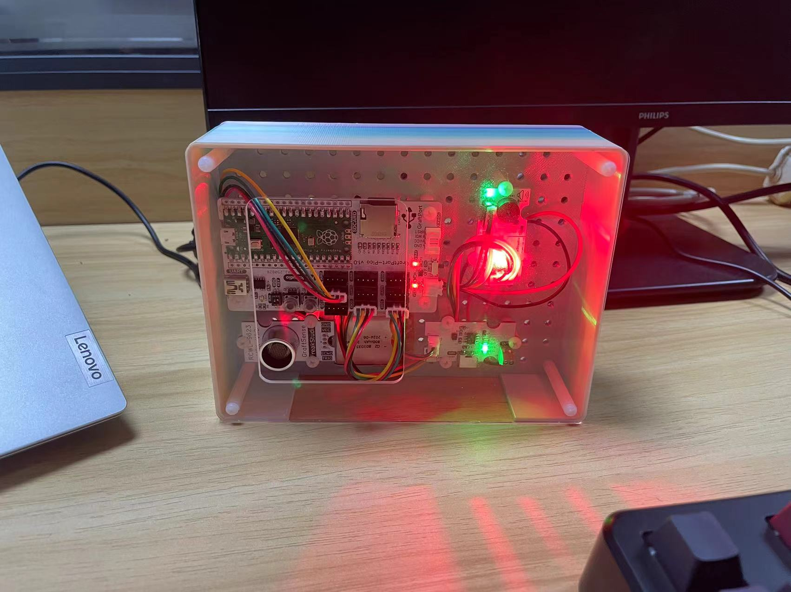

* **测距控制**：用手或物体靠近 RCWL9623（25-100cm 范围内），观察 LED 亮度是否随距离减小而增加，蜂鸣器频率是否随距离减小而升高；
* **按键切换**：按下板载按键，任务暂停（LED 熄灭、蜂鸣器静音），再次按下，任务恢复（声光随距离变化）；
* **异常测试**：断开 RCWL9623 的 I2C 线，程序会进入fatal_hang，板载 LED 两短闪循环，终端打印初始化失败信息。

在 `conf.py`中配置不变同时硬件连接没有问题的情况下，程序可以正常运行（随着手与设备距离变化蜂鸣器音调也在变化）：


终端输出结果如下所示：
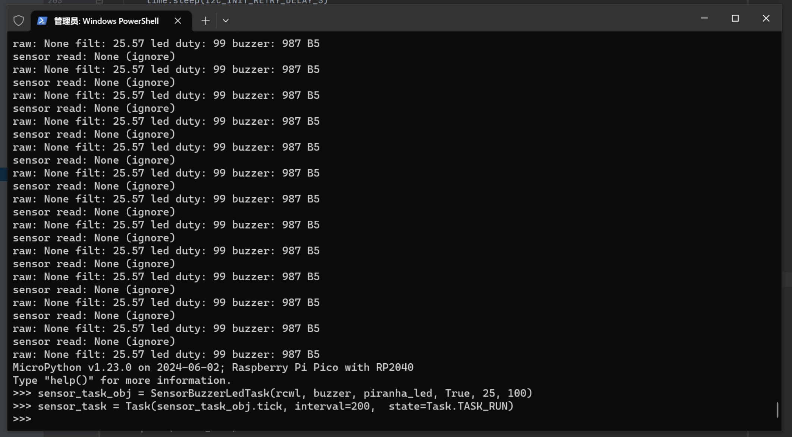

### 5. 调试与问题定位

* 若功能异常，确保`ENABLE_DEBUG = True`，在终端查看调试信息（如 “raw: 30 filt: 32 led duty: 85 buzzer: 880 A5”），判断数据是否正常；
* 若传感器初始化失败，检查 I2C 引脚连接、传感器地址（默认 0x57）、重试次数配置。
* 超声波传感器模块视场角较小，请保证手/物体尽可能在超声波探头的法线上移动。

## 示例程序（Example）

本项目没有其余参考示例代码，直接在firmware文件夹中进行修改即可。

## 注意事项（Notes）

* **传感器相关：**
  * RCWL9623 测距范围为 25-700cm，超出范围会返回 None 或异常值，代码中已做裁剪（默认 25-100cm），若需调整范围，修改`SensorBuzzerLedTask`的`min_dist`与`max_dist`参数；
  * RCWL9623 默认 I2C 地址为 `0x57`，若存在地址冲突，需修改传感器硬件跳线（若支持）或代码中的`I2C0_RCWL9623_ADDR`变量；
  * 传感器初始化重试次数建议≥3 次（`I2C_INIT_MAX_ATTEMPTS ≥3`），避免上电瞬间 I2C 通信不稳定导致初始化失败。
* **硬件连接相关：**
  * 共阴极 LED 需将`PiranhaLED`初始化时的`polarity`参数设为`POLARITY_CATHODE`，共阳极设为`POLARITY_ANODE`，极性错误会导致 LED 不亮或亮度异常；
  * 按键采用上拉输入（`Pin.PULL_UP`），按下时引脚电平为低，若按键无响应，检查引脚是否接反或中断触发方式（代码中为`Pin.IRQ_FALLING`）。
* **软件版本相关：**
  * 必须使用 MicroPython v1.23.0 及以上版本，低版本可能不支持deque（滤波缓冲）、软定时器调度或machine模块的部分方法；
  * `scheduler.py`依赖软定时器（Timer(-1)），若开发板不支持软定时器，需修改为硬件定时器（如Timer(0)），并确保定时器编号未被占用；
  * 调试打印（`ENABLE_DEBUG=True`）会占用一定内存与串口带宽，正式使用时建议关闭（`ENABLE_DEBUG=False`），提升系统运行效率。
* **功能使用相关：**
  * 任务周期（sensor_task的`interval=200ms`）不建议修改为≤100ms，否则可能导致传感器读取不完整或硬件控制频繁，增加 CPU 负载；
  * 自动 GC 阈值（`GC_THRESHOLD_BYTES`）建议设置为 100000-200000 字节，阈值过低会导致 GC 频繁触发（影响实时性），过高会导致内存不足崩溃；
  * 若开发板无板载 SD 卡，需在`board.py`的`DEFAULTS`中设置`HAS_SD=False`，避免初始化 SD 卡时抛错（代码中`get_sd_spi_config`不会影响核心功能，但会打印警告）。

## 版本记录（Version History）
* **v1.0.0 (2025-09-11)**：李清水完成初始版本，基本功能实现和文档编写，但是tools文件夹中自动化分析项目依赖、利用mpy-cross和mpremote工具编译批量上传mpy文件没有实现：
  * 支持 RCWL9623 实时测距、三点均值滤波；
  * 实现 LED 亮度非线性映射、蜂鸣器频率联动；
  * 支持按键中断切换任务启停、自动 GC、异常捕获与报错；
  * 适配 GraftPort-RP2040 开发板，提供完整的驱动与任务代码。

## 联系开发者（Contact）
如有任何问题或需要帮助，请通过以下方式联系开发者：  
📧 **邮箱**：10696531183@qq.com  
💻 **GitHub**：[https://github.com/FreakStudioCN](https://github.com/FreakStudioCN)  

## 许可协议（License）

本项目中，除 `machine` 等 MicroPython 官方模块（MIT 许可证）外，所有由作者编写的驱动与扩展代码均采用 **知识共享署名-非商业性使用 4.0 国际版 (CC BY-NC 4.0)** 许可协议发布。  

您可以自由地：  
- **共享** — 在任何媒介以任何形式复制、发行本作品  
- **演绎** — 修改、转换或以本作品为基础进行创作  

惟须遵守下列条件：  
- **署名** — 您必须给出适当的署名，提供指向本许可协议的链接，同时标明是否（对原始作品）作了修改。您可以用任何合理的方式来署名，但是不得以任何方式暗示许可人为您或您的使用背书。  
- **非商业性使用** — 您不得将本作品用于商业目的。  
- **合理引用方式** — 可在代码注释、文档、演示视频或项目说明中明确来源。  

**版权归 FreakStudio 所有。**
